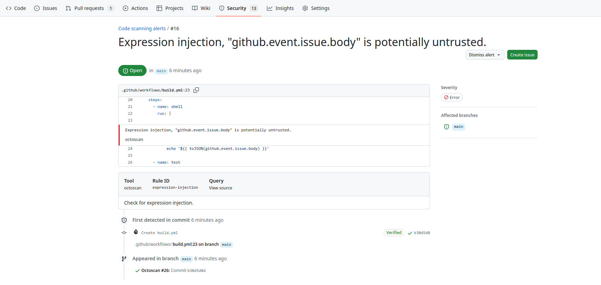

<div align="center" style="font-size: 148px;">
  📦 :octocat:
</div>

<h1 align="center">
  action octoscan
</h1>

<p align="center">
   A GitHub Action that performs a security scan of your GitHub actions.
</p>

<p align="center">
   This action is based on <a href="https://github.com/synacktiv/octoscan">octoscan</a>
</p>

<div align="center">
  
</div>

<div align="center">
  <a href="https://github.com/hugo-syn/octoscan-action/actions">
		
	</a>
</div>

<br />

- [🤸 Usage](#-usage)
- [Customizing](#-customizing)
  - [inputs](#inputs)
  - [outputs](#outputs)
- [Permissions](#permissions)

## 🤸 Usage

Here is a basic example of how to use this action. This will work for both `push` and `pull_request` events.

```yaml
---
name: Octoscan

on:
  workflow_dispatch:
  pull_request:
    paths:
      - '.github/workflows/*'
  push:
    paths:
      - '.github/workflows/*'

permissions:
  security-events: write
  actions: read
  contents: read

jobs:
  octoscan:
    runs-on: ubuntu-latest
    steps:
      - name: Checkout code
        uses: actions/checkout@v4

      - id: octoscan
        name: Run octoscan
        uses: hugo-syn/octoscan-action@v1

      - name: Upload SARIF file to GitHub
        uses: github/codeql-action/upload-sarif@v3
        with:
          sarif_file: "${{steps.octoscan.outputs.sarif_output}}"
          category: octoscan
```

Security results can the be reviewed in the code security tab if you have write access on the target repository:


Or directly in the pull request:


## Customizing

### inputs

Inputs are based on the options of `octoscan`, you can find them [here](https://github.com/synacktiv/octoscan?tab=readme-ov-file#analyze).

The following are optional as `step.with` keys:

| Name                       | Type    | Description                                                                                                                                                                                                                                                                                                                                                                                                                                     |
| -------------------------- | ------- | ----------------------------------------------------------------------------------------------------------------------------------------------------------------------------------------------------------------------------------------------------------------------------------------------------------------------------------------------------------------------------------------------------------------------------------------------- |
| `workdir`                     | String  | Working directory relative to the root directory.                                                                                                                                                                                                                                                                                                                                                                                              |
| `filter_triggers`                | String  | Scan workflows with specific triggers (comma separated list: "push,pull_request_target" or pre-configured: external/allnopr). Default is `external`.                                                                                                                                                                                                                                                                                                                                                                                 |
| `filter_run`                    | Boolean | Search for expression injection only in run shell scripts. Default is `true`                                                                                                                                                                                                                                                                                                                                                                                             |
| `ignore`               | String | Regular expression matching to error messages you want to ignore.                                                                                                                                                                                                                                                                                                                                                                                                    |
| `disable_rules`                    | String  | Disable specific rules. Split on ",". Can't be used with `enable_rules`.                                                                                                                                                                                                                                                                                                                                                                                |
| `enable_rules`                     | String  | Enable specific rules, this will disable all other rules. Split on ",". Can't be used with `disable_rules`.                                                                                                                                                                                                                                                                                                                                                                                  |

💡 It's not possible to use `enable_rules`  and `disable_rules` at the same time.

### outputs

The following outputs can be accessed via `${{ steps.<step-id>.outputs }}` from this action

| Name         | Type   | Description                                                                                                                                                                               |
| ------------ | ------ | ----------------------------------------------------------------------------------------------------------------------------------------------------------------------------------------- |
| `sarif_output`        | String | The name of the file containing the sarif output.                                                                                                                                                          |


### Permissions

This Action requires the following permissions on the GitHub integration token:

```yaml
permissions:
  security-events: write
  actions: read
  contents: read
```

`security-events` is used to push the output of octoscan to GitHub code scanning.
